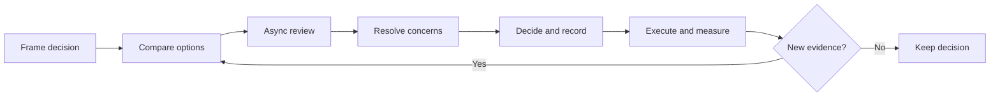

# Async Decisions

Distributed teams lose time when important context lives only in meetings. A short written decision process helps people contribute across time zones and lets future engineers understand why a choice was made.

## Use a Decision Record When

- The choice affects more than one team or service.
- Reversing it would be expensive.
- Security, privacy, compliance, reliability, or cost creates meaningful constraints.
- Several reasonable options exist and the tradeoff matters.
- A decision is likely to be questioned again after the original participants move on.

Do not create a formal record for routine implementation choices that a team can safely reverse.

## Lightweight Flow

1. **Frame the decision.** State the outcome required, deadline, owner, and constraints.
2. **Collect options.** Include a credible baseline and the option of doing nothing when relevant.
3. **Make tradeoffs visible.** Compare user value, reliability, security, cost, delivery risk, and reversibility.
4. **Invite bounded input.** Identify required reviewers and set a clear comment deadline.
5. **Decide explicitly.** Record the decision maker, date, rationale, dissent, and follow-up conditions.
6. **Communicate the result.** Link the record from roadmap items, design documents, and implementation work.
7. **Revisit on evidence.** Define the signal that would justify changing course.

## Working Across Time Zones

- Default to a written proposal before scheduling a meeting.
- Use a meeting for genuine disagreement, sensitive topics, or fast convergence, not information transfer.
- Publish notes and decisions immediately after synchronous discussion.
- Rotate inconvenient meeting times when synchronous attendance is unavoidable.
- Distinguish between **must review**, **input welcome**, and **FYI**.
- State when silence means consent and when explicit approval is required.

## Manager's Role

The manager sets decision clarity, not every technical answer. Ensure that the right owner has context, qualified reviewers can challenge assumptions, and unresolved risks reach the appropriate level early.
